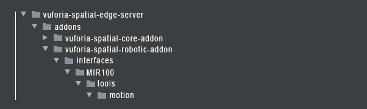
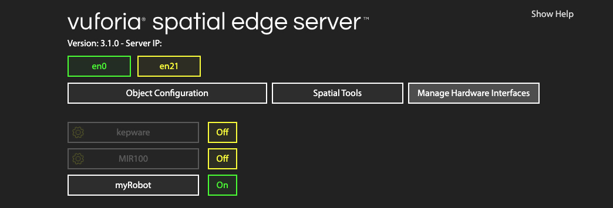

# vuforia-spatial-robotic-addon

The vuforia-spatial-robotic-addon contains the hardware interfaces for robotic systems. 
This hardware interfaces allow the connection to external hardware devices such as robots.

Each robotic addon contains the code needed to connect to each robot and a folder with tools.
The tools folder has default UI interfaces for different applications. 

Currently, our system contains a sample hardware interface for 1 robotic system:
* **[MIR100 AGV](https://www.mobile-industrial-robots.com/en/solutions/robots/mir100/)**

The main tool contained in the hardware interfaces is the motion tool. The motion tool allows for motion control and path planning of the different robotic addons.

This is the base structure:



You can create more robotic addons and more default tools for each one of them.

## Use the MIR100 robotic addon

In order to use the MIR100 robotic addon, follow the instructions on the [KineticAR tutorial](link to kineticAR)

## Develop new robotic addon

### Get Started

You may want to develop your own addon for your robot.
Follow the next steps:

Create a new folder with your robot name. Respect the folder structure.


The minimum your robot addon needs is an index.js. Create the file and add it to your robot addon folder.

Your index.js file should start with these two variables:

```
var server = require('@libraries/hardwareInterfaces');
var settings = server.loadHardwareInterface(__dirname);
```

The server variable will allow you to interface with your VST server.<br/>
The settings variable lets you use external paramaters to configure your hardware interface.

Now get the enabled variable in order to be able to active and deactivate the code on your interface from the VST server's web frontend:

```
exports.enabled = settings('enabled');

if (exports.enabled){

    // Code executed when your robotic addon is enabled

}

```

At this point, lets check if your robot interface is being detected by the VST server. Open the terminal, go to your server folder and run the server by typing:

```
node server.js
```

Open a browser and type:

```
localhost:8080
```

This will open the VST server frontend interface.
Go to Manage Hardware Interfaces.

On the left menu you will see a list with some default interfaces. You should see your new robot interface disabled in the list. You can enable or disable your robot addon by clicking ON or OFF next to it.



### Basic Methods

#### __addEventListener__
You can add event listeners that will get triggered when certain things happen on the server.
For example, you can add an event listener for when the server finishes initializing:

```
server.addEventListener("initialize", function () {
    console.log('VST Server has been initialized.');
    if (exports.enabled) startHardwareInterface();
});
```

Other events are: "shutdown", "reset", etc.


