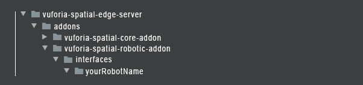

## Vuforia Spatial Robotic Add-on

The vuforia-spatial-robotic-addon contains the hardware interfaces for robotic systems in the [Vuforia Spatial Toolbox server](https://github.com/ptcrealitylab/vuforia-spatial-edge-server). 
These hardware interfaces allow the connection to external hardware devices such as robots that can be controlled in Augmented Reality, using VST tools.


Currently, our system contains a sample hardware interface for 1 robotic system:
* **[MIR100 AGV](https://www.mobile-industrial-robots.com/en/solutions/robots/mir100/)**

Each robotic addon contains the code needed to connect to each robot and a folder with tools.
The tools folder has default UI interfaces for different applications. 
The main tool contained in our MIR100 addon is the motion tool. The motion tool allows for motion control and path planning of the robot.

This is the base structure of the VST server with our MIR100 robotic addon:


You can create more robotic addons and more default tools for each one of them.


### Use the MIR100 robotic addon

In order to use the MIR100 robotic addon, follow the instructions on the [KineticAR tutorial](interfaces/MIR100/README.md)

### Develop new robotic addon

#### Get Started

You may want to develop your own addon for your robot. Follow the next steps:

Download or clone the [vuforia-spatial-edge-server](https://github.com/ptcrealitylab/vuforia-spatial-edge-server) code and place it in your Development folder on your computer.

Download or clone the [vuforia-spatial-robotic-addon](https://github.com/ptcrealitylab/vuforia-spatial-robotic-addon) code and place it in the following folder:

```
vuforia-spatial-edge-server/addons/
```

This folder contains all the code you need for your VST hardware interface. 

#### Installing Node.js

In order to run the server, you will need Node.js installed on your computer. 
Install [node.js](https://nodejs.org).<br />
Open a terminal window and navigate to your vuforia-spatial-edge-server folder.
Run the following:

```
npm install
```

This will install all the Node.js dependencies needed in your VST Server. 

#### Creating your robot addon

Create a new folder with your robot name. Respect the folder structure.



The minimum your robot addon needs is an index.js. Create the file and add it to your robot addon folder.

Your index.js file should start with these two variables:

```
var server = require('@libraries/hardwareInterfaces');
var settings = server.loadHardwareInterface(__dirname);
```

The server variable will allow you to interface with your VST server.<br/>
The settings variable lets you use external paramaters to configure your hardware interface.

Now get the enabled variable in order to be able to activate and deactivate the code on your interface from the VST server's web frontend:

```
exports.enabled = settings('enabled');

if (exports.enabled){

    // Code executed when your robotic addon is enabled

}
```

At this point, lets check if your robot interface is being detected by the VST server. Open the terminal, go to your server folder and run the server by typing:

```
node server.js
```

Open a browser and type:

```
localhost:8080
```

This will open the VST server frontend interface.
Go to Manage Hardware Interfaces.

On the left menu you will see a list with some default interfaces. You should see your new robot interface disabled in the list. You can enable or disable your robot addon by clicking ON or OFF next to it.


### Basic Server Methods

In order to connect your robotic addon to the server and to your tools, you will need to use some basic methods. 
The following methods are the most important ones in order to develop your robotic addon. 

#### loadHardwareInterface
Loads the hardware interface and gets the settings from the configuration file.

```
var settings = server.loadHardwareInterface(__dirname);
```

#### addEventListener
You can add event listeners that will get triggered when certain things happen on the server.
For example, you can add an event listener for when the server finishes initializing:

```
server.addEventListener("initialize", function () {
    console.log('VST Server has been initialized.');
    if (exports.enabled) startHardwareInterface();
});
```

Other events are: "shutdown", "reset", etc.

#### enableDeveloperUI
Set the developer UI true or false

```
server.enableDeveloperUI(true);
```

#### setTool

The Vuforia Spatial Toolbox works with a pocket of tools to manipulate in AR. These tools are, effectively, the AR user interfaces for different logic behaviors.
When working with a robot, if we want to have an AR user interface for our robot, we will need one or more tools for it.

You can access the [Tool Tutorial](https://github.com/ptcrealitylab/vuforia-spatial-toolbox-documentation/blob/master/make%20tools/toolTutorial.md), and familiarize yourself better with tools.

There can be infinite types of tools, and your robot may need to use a specific one that you create.
The setTool method allows you to specify a default tool that your robot addon will have and be able to use when needed.

```
server.setTool(objectName, 'objectToolName', 'defaultToolName', __dirname);
```

This will automatically copy your default tool, from your robotic addon tools folder, to your objectToolName folder in your realityobjects folder.

#### addNode

The Vuforia Spatial Toolbox tools make use of nodes in order to be programmed. This nodes can connect to eachother and are used to generate logic and behavior for the different tools and interfaces.
To learn more about nodes, visit our [Node Tutorial](https://github.com/ptcrealitylab/vuforia-spatial-toolbox-documentation/blob/master/make%20tools/toolboxNodes.md).

```
server.addNode(objectName, toolName, nodeName, nodeType); 
```

This method will add a node to the toolName tool.

#### moveNode

Change position, rotation or scale of node in AR.

```
server.modeNode(objectName, frameName, nodeName, x, y, scale, matrix, loyalty); 
```

#### addReadListener

This method allows you to add a listener to the programming node. Every time the node changes value, the callback is triggered.
You can, for example, create a node for your robot and connect a virtual button to it in order to turn it on.

```
server.addReadListener(objectName, frameName, nodeName, callBack);
```

### Authors

* **[Anna Fuste](https://github.com/afustePTC)**

See also the list of [contributors](https://github.com/ptcrealitylab/vuforia-spatial-robotic-addon/graphs/contributors) who participated in this project.

### License

This project is licensed under the MPL 2.0 License - see the [LICENSE](LICENSE) file for details

### Acknowledgments

* Hat tip to anyone whose code was used
* We thank Robb Stark for being on our wall watching all of us during the development process

