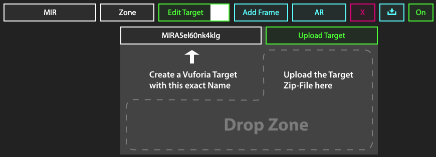
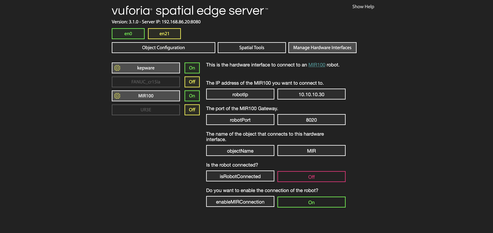

> IMPORTANT NOTE: Due to the current situation regarding COVID-19, we don't have access to the MIR100 AGV and have not been able to test the last tweaks to the interface. We have worked hard to ensure the correct functionality of the robotic addons but would much appreciate your patience if any bugs are found.


## MIR100 KineticAR Prototyping


This is a reference to build a [**Vuforia Spatial Toolbox** (VST)](https://forum.spatialtoolbox.vuforia.com ) KineticAR prototype using robotic interfaces for an [MIR100](https://www.mobile-industrial-robots.com/en/solutions/robots/mir100/) Automated Guided Vehicle. 
This is based on our [**Kinetic AR** UX framework](https://dl.acm.org/doi/abs/10.1145/3334480.3382814) and it works with two components:
* **[Robotic Addon Interface](../../README.md)** [To connect to the robot hardware]
* **[Motion Tool](tools/motion/motionTool.md)** [AR UI when looking at the robot with your mobile device]

The system creates a connection to the robot. A full spatial synchronization 
between the robot coordinate system and the [Vuforia Groundplane](https://library.vuforia.com/articles/Training/ground-plane-guide.html) coordinate system is enabled. 
It also allows for path planning and motion visualization in AR in real-time.

### Getting Started

These instructions will explain how to setup the Kinetic AR robotic addons and tools. 
You will have to clone or download the code for the VST repositories as explained later.

This tutorial explains the interface built for an [MIR100](https://www.mobile-industrial-robots.com/en/solutions/robots/mir100/) Automated Guided Vehicle, but can be adapted to any other robot.
The MIR example makes use of a Rest API and WebSockets in order to communicate with the AGV. 
If you have a different robotic system, you will need to adapt the code to be able to communicate with your specific hardware.

### Setup MIR100

Before using the Vuforia Spatial Toolbox, you need to setup the MIR100 with some specific missions.
This will allow the VST system to send commands to the MIR100 in order to perform the path planning.

Open the MIR100 browser interface and create a new mission called 'Move To Coordinate' of type Move to coordinate. 
This mission defines a X, Y position and orientation on the map the robot should move to.
You will have to create three variables for this mission and give them the following names:

* 'positionX' - X position
* 'positionY' - Y position
* 'orientation' - orientation

### Download code

1. Download the [vuforia-spatial-edge-server](https://github.com/ptcrealitylab/vuforia-spatial-edge-server) code and place it in your development folder on your computer.

2. Download the [vuforia-spatial-robotic-addon](https://github.com/ptcrealitylab/vuforia-spatial-robotic-addon) code and place it in the following folder:

```
vuforia-spatial-edge-server/addons/
```

This folder contains all the code you need for your VST hardware interface. A hardware interface is in charge of communicating with a specific piece of hardware.
The robotic addon interface will be in charge of talking to the robot and generating the specific nodes and logic needed for path planning.

### Installing Node.js

In order to run the server, you will need Node.js installed on your computer. 
Install [node.js](https://nodejs.org).<br />
Open a terminal window and navigate to your vuforia-spatial-edge-server folder.
Run the following:

```
npm install
```

This will install all the Node.js dependencies needed in your VST Server. 

Now navigate to your vuforia-spatial-robotic-addon folder and npm install again:

```
npm install
```

This will install all the Node.js dependencies needed in your robotic addon folder.

### Running your VST server

Now, go back to your root folder (vuforia-spatial-edge-server/) and you can run the server as follows:

```
node server
```

With your server running, open a browser and go to:

```
localhost:8080
```

The vuforia-spatial-edge-server interface should load on the browser. 
Here, you will find a list with all the VST Objects available.
The first time you run the VST Server, it will be empty.

 

### VST Objects

In your computer, the VST Objects are stored in the following folder:

```
Documents/spatialToolbox
```

This folder gets generated the first time you run the Reality Server.

### KineticAR Object and Motion Tool

You will need a virtual object that will represent your physical object (your robot) and a motion tool attached to it. 
> An object is a reference to your world physical object (aka your robot). 
The tool is a piece of AR content that will be attached to your physical object or physical surroundings [it is, essentially, the AR user interface].<br /> 

#### Creating trackable object

Your object will need a Vuforia object target in order to be identified and tracked.
You will have to generate this object target from the Vuforia Developer Portal. But first, you need to know the name of your target. Do the following:

With the server running, follow this steps on the VST Server interface on your browser:

* Click on 'Add Object'. Give this object the name of your robot: 'yourRobotNameHere'.
* Click on 'Add Target'

The interface will ask you to create a Vuforia Target with the name provided. 

 

This name (that follows the pattern: yourRobotName+ABunchOfLettersAndNumbers) is the name you need when generating your Vuforia Target.

Now go to the [Vuforia Developer Portal](https://developer.vuforia.com/).<br />
Go to the Target Manager and add a new target. When prompted, add the name you got from the VST interface (yourRobotName+aBunchOfLettersAndNumbers).

Download the target when processed. 
When prompted to select a development platform, select the option Android Studio, Xcode or Visual Studio.

#### Adding trackable object to VST server

Once you have downloaded your object/image target follow this steps on the VST Server interface on your browser:

On the 'Add Target' interface:
* Drop zip file or separate files (dat, xml and jpg) to the drop zone. The [OFF] button should turn to [ON]

Restart the server through the terminal

#### Initializing your robotic addon interface

If you want to use the existing MIR100 robotic addons, skip to 'Configure robot'.
However, if you want to learn how to create a new robotic addon for a different robotic system, continue reading.

In order to create your own robotic addon interface, access the following folder:

```
vuforia-spatial-edge-server/addons/vuforia-spatial-robotic-addon/interfaces/
```

In this folder, you will find all the robotic interfaces. 

You can build your interface from scratch, but if you want to create a path planning application, we recommend that you use our MIR100 interface code.
Duplicate the MIR100 folder and rename it with the name of your robot.

Inside of your robotic addon folder you will find another folder called 'tools'. These are the default tools that can be used with this robotic addon.

```
vuforia-spatial-edge-server/addons/vuforia-spatial-robotic-addon/interfaces/your_robot/tools
```

By default, this folder contains the motion tool that will work with your robotic addon interface.

#### Develop the motion tool

The motion tool is a user interface that is built from several Javascript files compiled together into a bundle.js file.

If you want to change or develop this tool further you will have to generate or update the bundle.js file that will contain all your tool code compiled in one file only.
To build the bundle.js file once, you can use the scripts found in the package.json on the root of the repo. For example:

```
npm run build-mir100
```

This command will trigger the generation of the bundle.js file for the MIR100 motion tool.
If your purpose is to develop, type this instead:

```
npm run watch-mir100
```

This second command will trigger the generation of the bundle.js file every time there is a change in your code. This is for development purposes.

If you create a new robotic addon and want to use this methods, you can add a new script command in the package.json on the root of the repo.

### Configure robot

The hardware interface for your robot, can optionally have configuration settings that you can change through the server browser interface.
To learn how to create a configuration page for your hardware interface on the server from scratch, read the [Configurable Hardware Interface readme file](https://github.com/ptcrealitylab/vuforia-spatial-toolbox-documentation/blob/master/interfaceWithHardware/configurableSettingsForInterfaces.md).

If you are using an MIR100 robot, we already have an interface for it. Follow the next steps:

Run the server:

```
node server
```

Go to the server in the browser:

```
localhost:8080
```


Select 'Manage Hardware Interfaces'.

You will see a list of the hardware interfaces that are on your server. You can turn them on and off.

Turn the MIR100 hardware interface on and click on the yellow gear for configuration.
You will see the configuration parameters for the MIR100 robot as follows:

 

Modify the parameters to match your configuration.
Modify the IP and port so that they match the one from your robot.
Change the object name to the name you used for your Object.
Finally, set enableMIRConnection to true, so that the software tries to connect to the robot.

Once this is all setup, stop your server. Go to the next section: Testing.

### Testing

At this point, you have everything setup and you should test to make sure that everything works together.
Follow these steps to ensure that your code runs properly.

* Make sure the computer running the server, the smartphone with the Reality Editor application, and your robot are on the same network.
* On your terminal, navigate to the folder 'vuforia-spatial-edge-server/'
* Run the server by typing:

```
node server.js
```

If you are using an MIR100 robot or have any other robot with configuration parameters on the server browser interface, access it in order to make sure the robot has been connected.

* Open the browser and go to:
```
localhost:8080
```

* Go to Manage hardware interfaces
* Your robot hardware interface should be ON.
* If you are using the MIR100 hardware interface, click on the yellow gear.
* Check that the isRobotConnected parameter is set to ON. This means the connection to the robot was successful

* Open the Reality Editor application on the phone
* On the side menu on the phone, click on the configuration gear
* Go to 'Found Objects'

Here, you will see a list of Objects that the server is looking for. Your object should be on this list.<br />
If your object is not on this list, something went wrong. Check out our troubleshooting section.

If your object is on the list, point with the phone at your physical object (aka your robot).
If your object target works, the main UI of the motion tool should show up on the device.

 

### Authors

* **[Anna Fuste](https://github.com/afustePTC)**

See also the list of [contributors](https://github.com/your/project/contributors) who participated in this project.

### License

This project is licensed under the MPL 2.0 License - see the [LICENSE](../../LICENSE) file for details

### Acknowledgments

* Hat tip to anyone whose code was used
* We thank Robb Stark for being on our wall watching all of us during the development process
